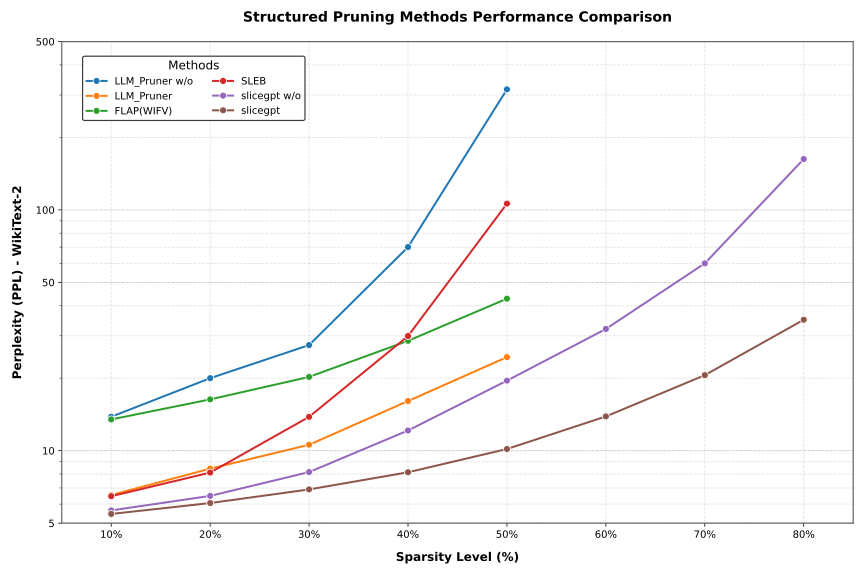
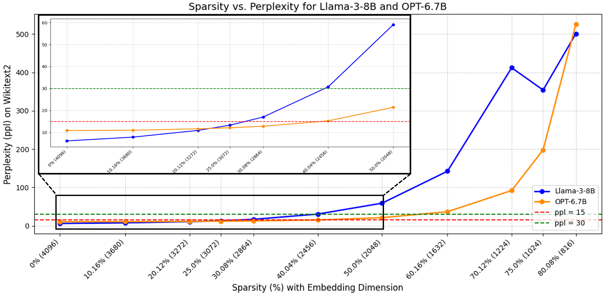
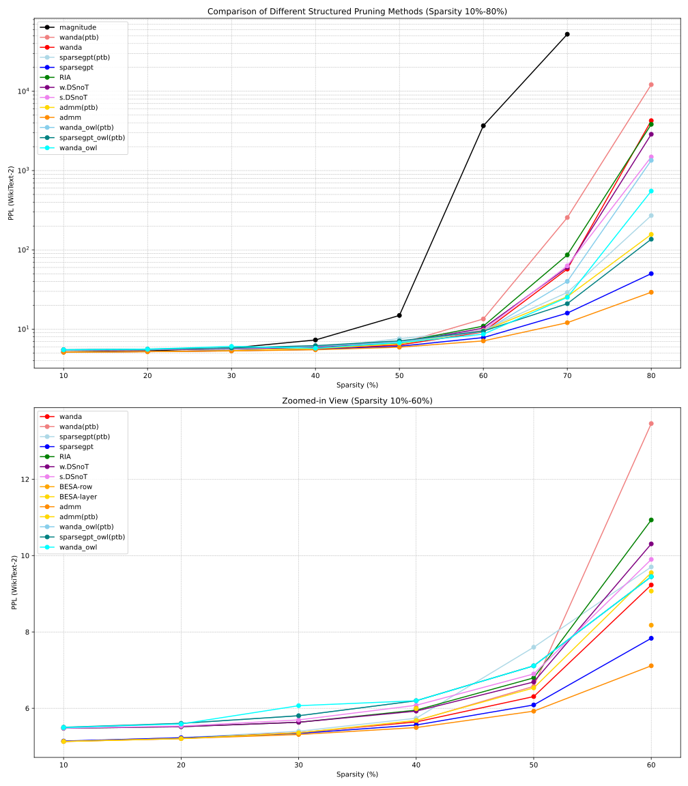
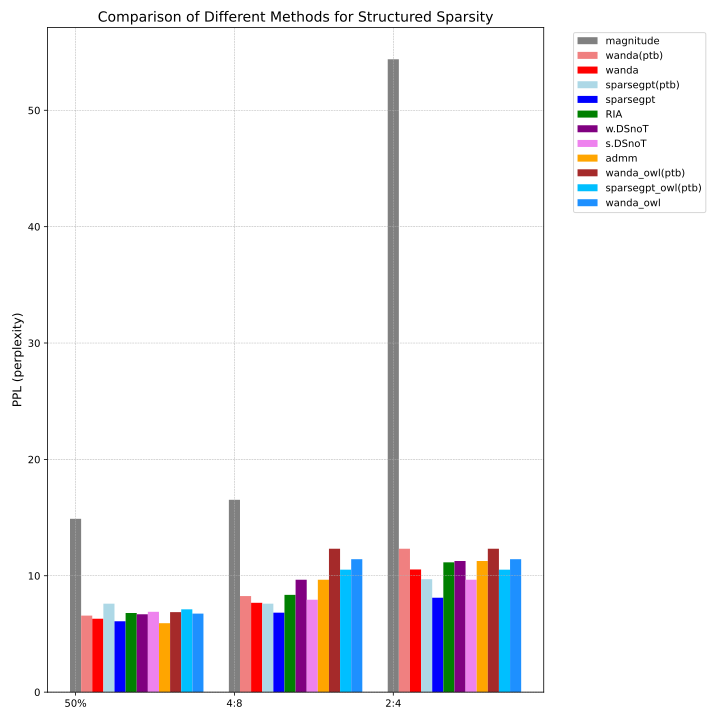
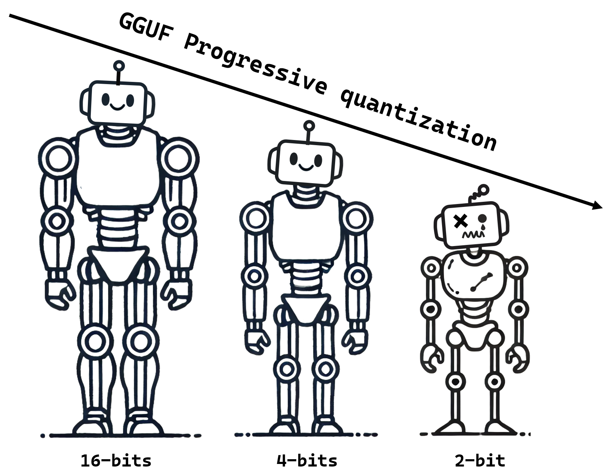
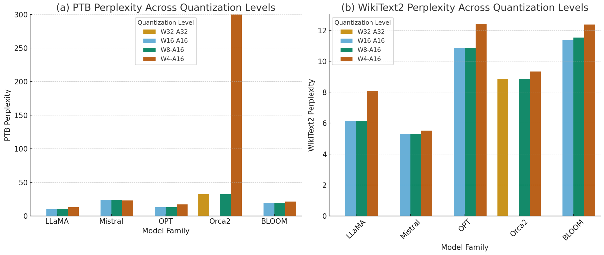
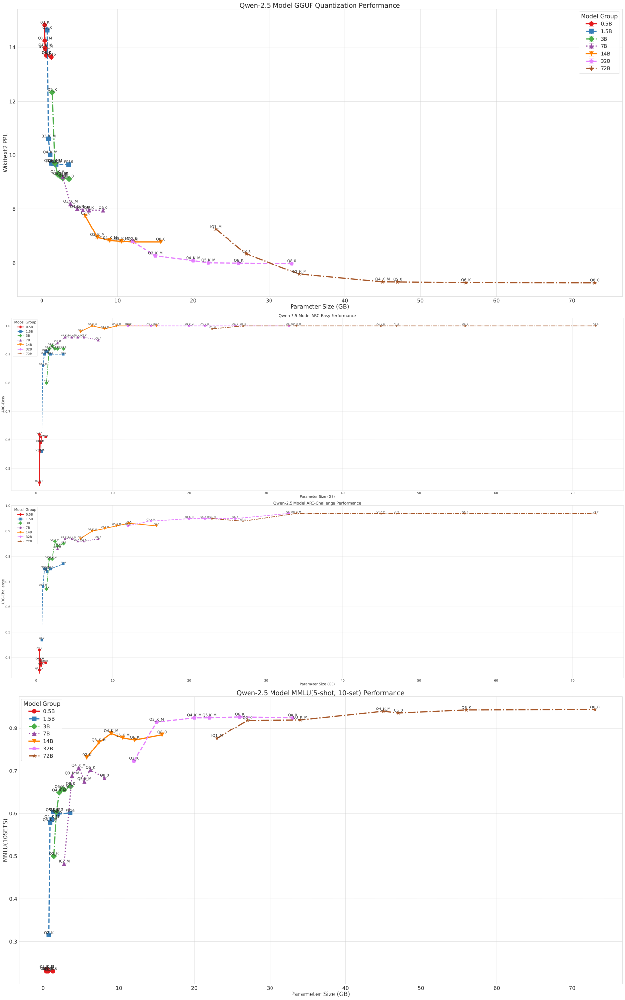
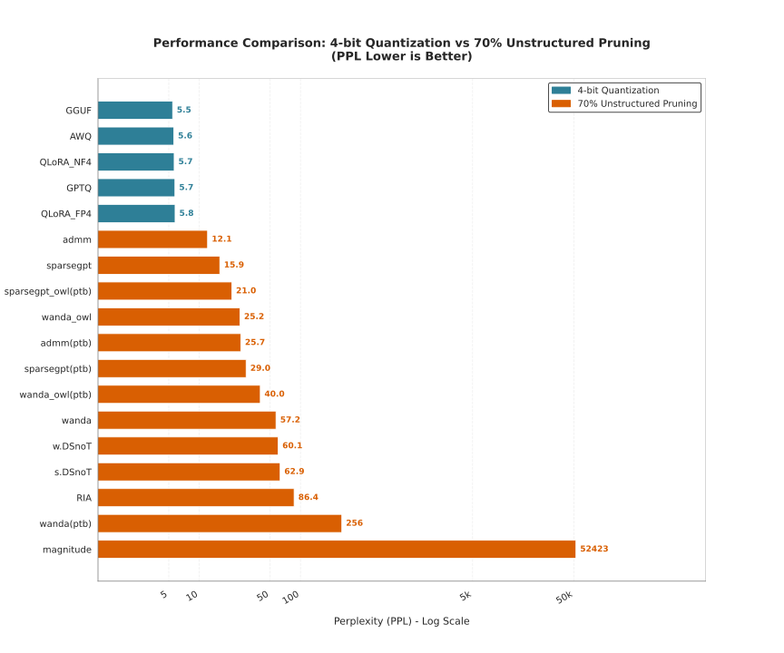
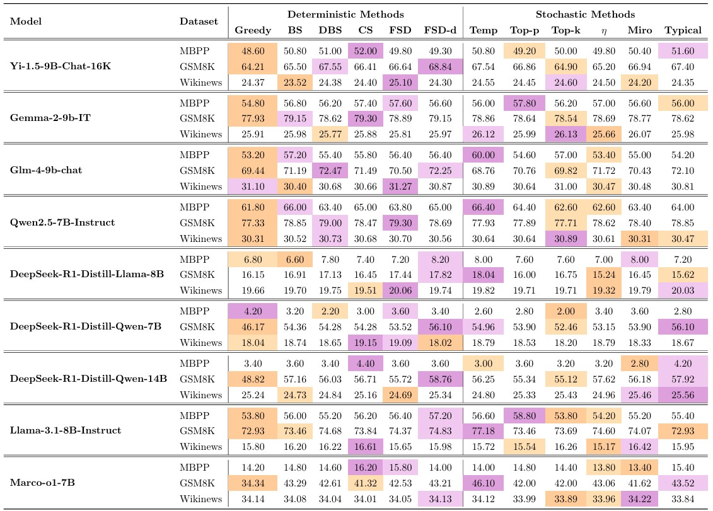

# Model-Phase-Transitions (MPT)
Phase Transitions in Large Language Model Compression: A Perspective

## 📬 Contact
If you find any errors or have suggestions, feel free to reach out: **maziyang@whu.edu.cn**

## 🏗️ The structural taxonomy for Model Phase Transitions.

## 🌐 About
In our work, we introduce the concept of **Model Phase Transition** to fundamentally characterize performance degradation and lossless compression limits in large language models. 

## Key Concepts
### 1. Model Redundancy  
| Type | Compression Handle | Intuition |
|------|--------------------|-----------|
| **Structural** | Structured / un-structured pruning | Remove unimportant heads, channels or weights while residual pathways self-heal.
| **Numerical** | Quantization | Most values lie in a narrow range; keep the outliers high-precision, down-sample the rest.
| **Algebraic** | Low-rank decomposition | Weight matrices live in a low-energy sub-space; factorise into skinny matrices. |

### 2. Model Phase Transition  
> *“The difference between a robustly-compressed model and a broken one is a single step past the PTP.”*

* **Definition** Gradual degradation up to a critical compression ratio **s₀**; exponential collapse beyond. Our piece-wise power-law + exponential curve fits 30 + methods.  
* **Typical PTPs**  
  * Structured pruning: **30–45 % sparsity**
  * Unstructured pruning: **55–65 % sparsity**
  * Quantization: **≥ 3-bit precision** to stay safe:contentReference
  * Low-rank: **≥ 17–30 % sparsity**

## 📚 Papers
Coming soon.

## 📊 Case Studies
### ✂ Sensitivity to Pruning
#### Features
🔍 **Cardinal sparsity thresholds for pruning**
> Pruning methods across different categories have specific **cardinal sparsity** thresholds that greatly affect their performance.
> 
> **Structured pruning** typically exhibits a critical sparsity threshold around **50%**. Beyond this point, performance starts to degrade significantly, often leading to the collapse of the model. While it accelerates inference, the trade-off is often not worth it as the model’s accuracy is heavily impacted.
> 
> **Unstructured pruning** and **semi-structured pruning** methods can achieve much higher sparsity levels, with a threshold around **80%**.
>
🏁 **Horizontal comparisons across structured pruning, unstructured pruning, and semi-structured pruning**
> In a horizontal comparison, at similar compression rates, unstructured pruning consistently outperforms semi-structured pruning, which in turn, outperforms structured pruning.

🛠️ **Problems with Existing Pruning Methods**
> **Structured pruning's limitations**:  While pruning techniques have shown promise, they come with inherent limitations and trade-offs: While the main advantage of structured pruning lies in inference speedup, as highlighted in several recent papers, practical observations reveal that the trade-off between accuracy and speed is not always favorable. When sparsity exceeds 50\%, the model generally collapses, providing less than a 2x speedup.
>
> **Semi-structured pruning's weaknesses**: Recently, semi-structured pruning methods are often discussed alongside unstructured pruning, but they fail to outperform unstructured pruning and don't offer clear advantages of their own. In practice, while they can achieve moderate compression, they struggle to maintain model performance compared to unstructured pruning methods. Their overall lack of competitiveness at comparable compression rates raises questions about their utility.
>
> **Challenges in unstructured pruning**: Unstructured pruning methods can achieve high compression rates (typically over 70%), but the performance trade-off is significant. Despite promising results in theory, practical applications face difficulties with acceleration. Many studies that use methods like Wanda and SparseGPT as baselines focus on extreme compression rates (>70%) for performance comparisons. However, these rates tend to cause catastrophic performance degradation, often referred to as "model hemorrhaging." In contrast, Wanda and SparseGPT perform better at lower sparsity levels, where other improved models fall short. Future research may need to shift focus towards performance at lower compression rates, possibly exploring combinations of pruning with quantization techniques to achieve better compression and faster inference without sacrificing too much accuracy. 
>
#### **Experimental Evaluation of Structured Pruning Methods Results**

**Fig. 1: Performance comparison of different structured pruning methods applied to LLaMA2-7b, based on the WikiText2-PPL (Perplexity) metric, across varying sparsity levels. The chart highlights the impact of pruning on model performance, with lower PPL values indicating better performance.**

**Fig. 2: Perplexity performance of LLaMA-3-8B and OPT-6.7B under different pruning ratios (Pruned by Slicegpt).**

**Table 1: WikiText2-PPL results for structured pruning (w/o: without finetuning)**

| Method                | 0.1    | 0.2    | 0.3    | 0.4    | 0.5    | 0.6    | 0.7    | 0.8    |
|-----------------------|--------|--------|--------|--------|--------|--------|--------|--------|
| LLM_Pruner w/o        | 13.8316| 20.0072| 27.4537| 70.1054| 316.6549| -      | -      | -      |
| LLM_Pruner            | 6.5463 | 8.4221 | 10.5843| 16.0763| 24.4655 | -      | -      | -      |
| FLAP(WIFV)            | 13.4835| 16.3325| 20.2505| 28.6018| 42.7961 | -      | -      | -      |
| SLEB                  | 6.4700 | 8.1100 | 13.8200| 29.9300| 106.1900| -      | -      | -      |
| slicegpt w/o          | 5.6500 | 6.4900 | 8.1500 | 12.1300| 19.5400 | 32.0300 | 59.9800 | 162.65 |
| slicegpt              | ****5.4610**** | ****6.0607**** | ****6.9047**** | ****8.1353**** | ****10.1622**** | ****13.8773**** | ****20.5934**** | ****34.9808**** |

---

#### **Experimental Evaluation of Unstructured Pruning Methods Results**

**Fig. 3: WikiText2 perplexity (PPL) trends for various structured pruning methods across sparsity levels ranging from 10\% to 80\%. The upper part of the figure shows the overall trend across the full sparsity spectrum, while the lower part zooms in on the 10\%--60\% range to highlight differences among pruning methods at moderate compression levels. Methods with "(ptb)" suffix indicate usage of the PTB calibration dataset in ablation studies. The results show that while many pruning methods suffer significant performance drops at higher sparsity, approaches like Wanda, SparseGPT, and ADMM consistently preserve model quality under lower sparsity, suggesting greater robustness and practical viability. Note that the magnitude pruning curve is omitted from the lower subplot, as it consistently shows the worst degradation and dominates the y-axis range in zoomed-in views.**

---

#### **Comparison of Unstructured and Semi-structured Pruning Methods**

**Fig. 4: Comparison of the performance of unstructured and structured pruning methods on WikiText2 PPL at 50\% sparsity. The figure compares the perplexity (PPL) of various pruning methods for a model pruned to 50\% sparsity. The methods include unstructured pruning (50\%), and two types of structured pruning: 4:8 and 2:4, which indicate that 4 out of every 8 weights or 2 out of every 4 weights are pruned, respectively.**

**Table 2: WikiText2-PPL for different unstructured and semi-structured methods**

| Method                | 0.1    | 0.2    | 0.3    | 0.4    | 0.5    | 0.6    | 0.7    | 0.8    | 2:4(0.5) | 4:8(0.5) |
|-----------------------|--------|--------|--------|--------|--------|--------|--------|--------|----------|----------|
| Magnitude             | 5.1737 | 5.3292 | 5.7920 | 7.3069 | 14.8954 | 3676.1436 | 52422.6016 | nan     | 54.3870 | 16.5288 |
| Wanda                 | <u>5.1352</u> | <u>5.2269</u> | 5.3609 | 5.6434 | 6.3075  | 9.2307  | 57.2495 | 4262.4902 | 10.5414 | 7.6748  |
| SparseGPT             | 5.1428 | 5.2277 | <u>5.3423</u> | <u>5.5635</u> | <u>6.0882</u> | <u>7.8341</u> | <u>15.9474</u> | <u>50.1593</u> | <u>8.1100</u> | ****6.8299**** |
| RIA                   | 5.4777 | 5.5181 | 5.6338 | 5.9517 | 6.7974 | 10.9329 | 86.4084 | 3832.7690 | 11.1520 | 8.3561 |
| w.DSnoT               | 5.4789 | 5.5190 | 5.6344 | 5.9264 | 6.6898 | 10.3059 | 60.1499 | 2870.5852 | 11.2686 | 9.6594 |
| s.DSnoT               | 5.4805 | 5.5347 | 5.6958 | 6.0794 | 6.8997 | 9.6878 | 62.8766 | 1487.4147 | 9.6594  | 7.9369  |
| ADMM                  | ****5.1315**** | ****5.2076**** | ****5.3134**** | ****5.4959**** | ****5.9252**** | ****7.1137**** | ****12.0747**** | ****29.2164**** | ****7.5892**** | <u>7.5892</u> |
| Wanda_owl             | 5.4989 | 5.5901 | 6.0690 | 5.7550 | 6.7490 | 8.6492 | 25.1889 | 551.7274 | 11.4216 | - |
| BESA-row              | -      | -      | -      | -      | 6.0057 | -      | 8.1769  | -      | -        | -        |
| BESA-layer            | -      | -      | -      | -      | 5.9884 | -      | 9.0709  | -      | -        | -        |

**Table 3: WikiText2-PPL for different unstructured and semi-structured methods calibrate on PTB dataset**

| Method                | 0.1    | 0.2    | 0.3    | 0.4    | 0.5    | 0.6    | 0.7    | 0.8    | 2:4(0.5) | 4:8(0.5) |
|-----------------------|--------|--------|--------|--------|--------|--------|--------|--------|----------|----------|
| Wanda                 | <u>5.1313</u> | ****5.205**** | ****5.3455**** | ****5.6736**** | <u>6.5758</u> | 13.4577 | 255.5912 | 12142.1484 | 12.5204 | <u>8.2569</u> |
| SparseGPT             | 5.135  | 5.2305 | 5.3994 | 5.74   | 7.5999 | 9.7025 | 29.0151 | 270.8205 | ****9.7025**** | ****7.5999**** |
| Wanda_owl             | 5.4885 | 5.5719 | 5.7487 | 6.0911 | 6.8722 | ****9.3082**** | 40.0371 | 1346.3525 | 12.3241 | - |
| SparseGPT_owl         | 5.5043 | 5.6054 | 5.8055 | 6.1986 | 7.1123 | <u>9.4483</u> | ****20.963**** | ****136.4502**** | 10.5258 | - |
| ADMM                  | ****5.1292**** | <u>5.2079</u> | <u>5.3587</u> | <u>5.6827</u> | ****6.5338**** | 9.5521 | <u>25.6936</u> | <u>156.7145</u> | <u>10.0416</u> | <u>10.0416</u> |

### 🔨 Sensitivity to quantization

**Fig. 5: GGUF progressive quantization with critical 3-bit threshold**

#### Features
🔍  **Lossless quantization thresholds**
> Quantization exhibits a "safe compression zone" (critical 3-bit threshold), beyond which performance degrades nonlinearly—yet larger models retain superior performance under low-bit settings compared to smaller "full-scale" counterparts at the same memory footprint.
> 
🏁 **Horizontal comparison of different models and different quantification methods**
> We conducted weight-only quantization experiments on base models of approximately 7B parameters using GPTQ with 8-bit and 4-bit precision. The models evaluated include LLaMA-3-8B, Mistral-7B, OPT-6.7B, Orca2-7B, and BLOOM-7.1B. The results indicate that most models exhibit stable performance after both 8-bit and 4-bit quantization.
>
> We evaluate several widely used Post-Training Quantization (PTQ) methods on LLaMA2-7b, using the WikiText2 dataset and a maximum input length of 2K. The evaluation focuses on PPL (Perplexity) to assess the model's accuracy retention after quantization. The results show that most quantization methods maintain good accuracy, with a maximum precision loss of only 5\% at 4-bit quantization.
> 
📉 **Progressive quantization curves at full model scale**
> To systematically evaluate the impact of model quantization on inference performance (PPL, inference speed, ARC-Easy, ARC-Challenge, and MMLU), we conducted comprehensive experiments on multiple models quantized via the GGUF framework. These experiments covered progressive quantization from 1-bit to 16-bit precision, focusing on well-performing yet moderately sized Qwen-2.5 model families (0.5B、1.5B，3B，7B，14B，32B，72B). Furthermore, given the remarkable performance recently exhibited by DeepSeek-R1, we also incorporated several DeepSeek-R1-distilled variants of LLaMA-3.1 and Qwen-2.5.
> 

**Fig. 6: Perplexity of 5 models across quantization levels. (a) PTB. (b) Wikitext2.**

**Fig. 7: The performance of the Qwen-2.5 model under various GGUF quantization schemes across multiple datasets and scales. This figure presents four subplots stacked vertically: (Top) WikiText2 perplexity (PPL), (Second) ARC-Easy accuracy, (Third) ARC-Challenge accuracy, (Bottom) MMLU accuracy. Results are shown across multiple model scales (0.5B, 1.5B, 3B, 7B, 14B, 32B, and 72B). These subplots demonstrate the performance trends of the Qwen-2.5 model under different quantization settings, helping to illustrate the impact of GGUF quantization on both perplexity and accuracy across a range of tasks and model sizes.**

**Table 4:Wikitext2-PPL results for various quantization methods with different bit configurations(2K).**

| Method             | 2bits  | 3bits  | 4bits  | 8bits  |
|--------------------|--------|--------|--------|--------|
| GPTQ               | 1784.1625 | 7.5768  | 5.7459  | *5.4739* |
| AWQ                | -      | <u>6.2431</u> | <u>5.6009</u> | -      |
| GGUF               | **5.8619** | **5.5463** | **5.4549** | **5.3976** |
| QLoRA_NF4          | -      | -      | 5.6500  | -      |
| QLoRA_FP4          | -      | -      | 5.7700  | -      |
| LLM.int8()         | -      | -      | -      | 5.5000  |
| SmothQuant w8a8    | -      | -      | -      | 5.5934  |

**Table 5:Comprehensive evaluation of quantized models including perplexities (PPL), inference speed, parameter sizes, and downstream task performance (ARC-Easy, ARC-Challenge, and MMLU).**

| **Main Model**                     | **Indicator**  | **1-bit** | **2-bit** | **3-bit** | **4-bit** | **5-bit** | **6-bit** | **8-bit** | **16-bit** |
|------------------------------------|----------------|-----------|-----------|-----------|-----------|-----------|-----------|-----------|------------|
| **Qwen2.5-0.5B**                   | **Quant Scheme**| -         | Q2_K      | Q3_K_M    | Q4_K_M    | Q5_K_M    | Q6_K      | Q8_0      | FP16       |
|                                    | **PPL**        | -         | 14.8206 ± 0.1111 | 14.2463 ± 0.1062 | 13.9797 ± 0.1039 | 13.9324 ± 0.1038 | 13.7029 ± 0.1018 | 13.7042 ± 0.1018 | 13.6439 ± 0.1012 |
|                                    | **Tokens/s**   | -         | 5593.6    | 5343.97   | 5370.62   | 5385.33   | 5427.74   | 5465.18   | 4266.22    |
|                                    | **Param(GB)**  | -         | 0.41      | 0.42      | 0.48      | 0.52      | 0.63      | 0.66      | 1.27       |
|                                    | **ARC-C**      | -         | 0.43      | 0.35      | 0.39      | 0.39      | 0.37      | 0.38      | 0.38       |
|                                    | **ARC-E**      | -         | 0.62      | 0.45      | 0.56      | 0.59      | 0.59      | 0.61      | 0.61       |
|                                    | **MMLU**       | -         | 0.231     | 0.236     | 0.235     | 0.231     | 0.231     | 0.231     | 0.231      |
| **Qwen2.5-1.5B**                   | **Quant Scheme**| -        | Q2_K      | Q3_K_M    | Q4_K_M    | Q5_K_M    | Q6_K      | Q8_0      | FP16       |
|                                    | **PPL**        | -         | 14.6341 ± 0.1034 | 10.6066 ± 0.0733 | 10.0107 ± 0.0684 | 9.7016 ± 0.0659 | 9.6790 ± 0.0658 | 9.6617 ± 0.0657 | 9.6555 ± 0.0657 |
|                                    | **Tokens/s**   | -         | 3814.78   | 3630.17   | 3843.72   | 3494.1    | 3543.53   | 3265.56   | 2133.91    |
|                                    | **Param(GB)**  | -         | 0.74      | 0.90      | 1.12      | 1.29      | 1.46      | 1.89      | 3.56       |
|                                    | **ARC-C**      | -         | 0.47      | 0.68      | 0.75      | 0.75      | 0.74      | 0.75      | 0.77       |
|                                    | **ARC-E**      | -         | 0.56      | 0.86      | 0.90      | 0.91      | 0.91      | 0.90      | 0.90       |
|                                    | **MMLU**       | -         | 0.315     | 0.579     | 0.586     | 0.603     | 0.603     | 0.598     | 0.601      |
| **Qwen2.5-3B**                     | **Quant Scheme**| -        | Q2_K      | Q3_K_M    | Q4_K_M    | Q5_K_M    | Q6_K      | Q8_0      | FP16       |
|                                    | **PPL**        | -         | 12.3285 ± 0.0904 | 9.7013 ± 0.0684 | 9.2818 ± 0.0649 | 9.2155 ± 0.0646 | 9.1428 ± 0.0641 | 9.1195 ± 0.0639 | -          |
|                                    | **Tokens/s**   | -         | 2397.99   | 2166.52   | 2117.6    | 2005.48   | 1669.51   | 1427.8    | -          |
|                                    | **Param(GB)**  | -         | 1.38      | 1.72      | 2.10      | 2.44      | 2.79      | 3.62      | -          |
|                                    | **ARC-C**      | -         | 0.67      | 0.79      | 0.79      | 0.86      | 0.84      | 0.85      | -          |
|                                    | **ARC-E**      | -         | 0.80      | 0.92      | 0.93      | 0.92      | 0.92      | 0.92      | -          |
|                                    | **MMLU**       | -         | 0.500     | 0.604     | 0.649     | 0.657     | 0.656     | 0.664     | -          |
| **Qwen2.5-7B**                     | **Quant Scheme**| -        | IQ2_M     | Q3_K_M    | Q4_K_M    | Q5_K_M    | Q6_K      | Q8_0      | FP16       |
|                                    | **PPL**        | -         | 9.2085 ± 0.0627 | 8.1920 ± 0.0550 | 7.9982 ± 0.0533 | 7.9628 ± 0.0529 | 7.9505 ± 0.0528 | 7.9493 ± 0.0528 | -          |
|                                    | **Tokens/s**   | -         | 1439.49   | 952.80    | 1014.46   | 727.07    | 759.87    | 520.07    | -          |
|                                    | **Param(GB)**  | -         | 2.78      | 3.81      | 4.68      | 5.44      | 6.25      | 8.10      | -          |
|                                    | **ARC-C**      | -         | 0.83      | 0.87      | 0.87      | 0.86      | 0.86      | 0.87      | -          |
|                                    | **ARC-E**      | -         | 0.94      | 0.96      | 0.96      | 0.96      | 0.96      | 0.95      | -          |
|                                    | **MMLU**       | -         | 0.482     | 0.688     | 0.707     | 0.675     | 0.702     | 0.683     | -          |
| **Qwen2.5-14B**                    | **Quant Scheme**| -        | Q2_K      | Q3_K_M    | Q4_K_M    | Q5_K_M    | Q6_K      | Q8_0      | FP16       |
|                                    | **PPL**        | -         | 7.7406 ± 0.0515 | 6.9516 ± 0.0446 | 6.8339 ± 0.0437 | 6.8031 ± 0.0435 | 6.7826 ± 0.0434 | 6.7821 ± 0.0433 | -          |
|                                    | **Tokens/s**   | -         | 320.36    | 311.41    | 303.88    | 314.02    | 257.84    | 185.52    | -          |
|                                    | **Param(GB)**  | -         | 5.77      | 7.34      | 8.99      | 10.50     | 12.10     | 15.70     | -          |
|                                    | **ARC-C**      | -         | 0.87      | 0.90      | 0.91      | 0.92      | 0.93      | 0.92      | -          |
|                                    | **ARC-E**      | -         | 0.98      | 1.00      | 0.99      | 1.00      | 1.00      | 1.00      | -          |
|                                    | **MMLU**       | -         | 0.731     | 0.766     | 0.787     | 0.777     | 0.772     | 0.784     | -          |
| **Qwen2.5-32B**                    | **Quant Scheme**| -        | Q2_K      | Q3_K_M    | Q4_K_M    | Q5_K_M    | Q6_K      | Q8_0      | FP16       |
|                                    | **PPL**        | -         | 6.7997 ± 0.0433 | 6.2621 ± 0.0392 | 6.0862 ± 0.0380 | 6.0080 ± 0.0374 | 5.9949 ± 0.0373 | 5.9762 ± 0.0371 | -          |
|                                    | **Tokens/s**   | -         | 139.78    | 137.34    | 136.93    | 191.87    | 196.46    | 143.49    | -          |
|                                    | **Param(GB)**  | -         | 12.0      | 15.0      | 20.0      | 22.0      | 26.0      | 33.0      | -          |
|                                    | **ARC-C**      | -         | 0.92      | 0.94      | 0.95      | 0.95      | 0.95      | 0.983     | -          |
|                                    | **ARC-E**      | -         | 1.0       | 1.0       | 1.0       | 1.0       | 1.0       | 1.0       | -          |
|                                    | **MMLU**       | -         | 0.723     | 0.814     | 0.824     | 0.824     | 0.826     | 0.824     | -          |
| **Qwen2.5-72B**                    | **Quant Scheme**| IQ1_M    | Q2_K      | Q3_K_M    | Q4_K_M    | Q5_K_M    | Q6_K      | Q8_0      | -          |
|                                    | **PPL**        | 7.2507 ± 0.0468 | 6.3354 ± 0.0412 | 5.5831 ± 0.0348 | 5.3012 ± 0.0325 | 5.2964 ± 0.0327 | 5.2720 ± 0.0325 | 5.2644 ± 0.0325 | -          |
|                                    | **Tokens/s**   | 96.60     | 100.13    | 83.56     | 62.33     | 95.96     | 108.05    | 177.27    | -          |
|                                    | **Param(GB)**  | 23.7      | 29.8      | 37.7      | 47.4      | 47.0      | 56.0      | 73.0      | -          |
|                                    | **ARC-C**      | 0.95      | 0.94      | 0.97      | 0.97      | 0.97      | 0.97      | 0.97      | -          |
|                                    | **ARC-E**      | 0.99      | 1.0       | 1.0       | 1.0       | 1.0       | 1.0       | 1.0       | -          |
|                                    | **MMLU**       | 0.776     | 0.818     | 0.819     | 0.839     | 0.835     | 0.842     | 0.843     | -          |
| **DeepSeek-R1-Distill-Qwen-14B**    | **Quant Scheme**| -        | Q2_K      | Q3_K_M    | Q4_K_M    | Q5_K_M    | Q6_K      | Q8_0      | FP16       |
|                                    | **PPL**        | -         | 11.8656 ± 0.0950 | 9.8112 ± 0.0757 | 9.4530 ± 0.0727 | 9.3903 ± 0.0723 | 9.3819 ± 0.0724 | 9.3873 ± 0.0726 | -          |
|                                    | **Tokens/s**   | -         | 497.57    | 405.06    | 420.73    | 403.24    | 263.45    | 257.8     | -          |
|                                    | **Param(GB)**  | -         | 5.77      | 7.34      | 8.99      | 10.51     | 12.12     | 15.7      | -          |
| **DeepSeek-R1-Distill-Llama-8B**    | **Quant Scheme**| -        | Q2_K      | Q3_K_M    | Q4_K_M    | Q5_K_M    | Q6_K      | Q8_0      | FP16       |
|                                    | **PPL**        | -         | 17.8570 ± 0.14628 | 13.9558 ± 0.11277 | 13.1239 ± 0.10704 | 12.9391 ± 0.10526 | 12.8593 ± 0.10475 | 12.8417 ± 0.10423 | 12.8459 ± 0.10436 |
|                                    | **Tokens/s**   | -         | 1105.2    | 799.52    | 914.69    | 1015.46   | 942.53    | 809.24    | 299.6      |
|                                    | **Param(GB)**  | -         | 3.18      | 4.02      | 4.92      | 5.73      | 6.6       | 8.54      | 16.1       |
| **Llama-3.1-8B**                   | **Quant Scheme**| -        | Q2_K      | Q3_K_M    | Q4_K_M    | Q5_K_M    | Q6_K      | Q8_0      | FP16       |
|                                    | **PPL**        | -         | 9.0215 ± 0.0564 | 7.8101 ± 0.0485 | 7.5282 ± 0.0465 | 7.4543 ± 0.0461 | 7.4250 ± 0.0458 | 7.4075 ± 0.0457 | -          |
|                                    | **Tokens/s**   | -         | 817.69    | 1031.46   | 919.29    | 561.81    | 570.54    | 435.94    | -          |
|                                    | **Param(GB)**  | -         | 2.95      | 4.02      | 4.92      | 5.73      | 6.6       | 8.54      | -          |

### 🥇 Horizontal comparisons across different compression strategies
🏁 We compare various model compression methods, including both pruning and quantization techniques, under a 50\% sparsity setting. The LLaMA2-7b model was tested on the WikiText2 dataset using Perplexity (PPL) as the performance metric. The results indicate that quantization outperforms pruning methods in terms of accuracy retention, with the ranking of performance being: Quantization > Unstructured Pruning > Semi-structured Pruning > Structured Pruning.

**Fig. 8: Comparison of perplexity (PPL) for quantization and pruning methods at 50\% compression rate on Wikitext2. Lower PPL indicates better performance. Quantization outperforms all pruning strategies, with unstructured pruning showing moderate robustness compared to semi-structured and structured approaches.**

**Fig. 9: High-compression regime (70\% sparsity or 4-bit quantization) performance on Wikitext2. Quantization (e.g., GGUF: 5.5 PPL) demonstrates exceptional precision retention, while unstructured pruning methods (e.g., wanda: 57.2 PPL) suffer significant degradation, highlighting the challenges of maintaining accuracy under extreme compression.**

### 🏆 Horizontal comparisons across different decoding strategies
We evaluate the performance of various decoding strategies on nine models (7B–9B) using both closed-ended tasks (MBPP, GSM8K) and open-ended tasks (Wikinews). Our experimental setup closely follows the approach outlined by Shi et al.

**Fig. 10: Performance of models under deterministic and stochastic decoding methods.**

